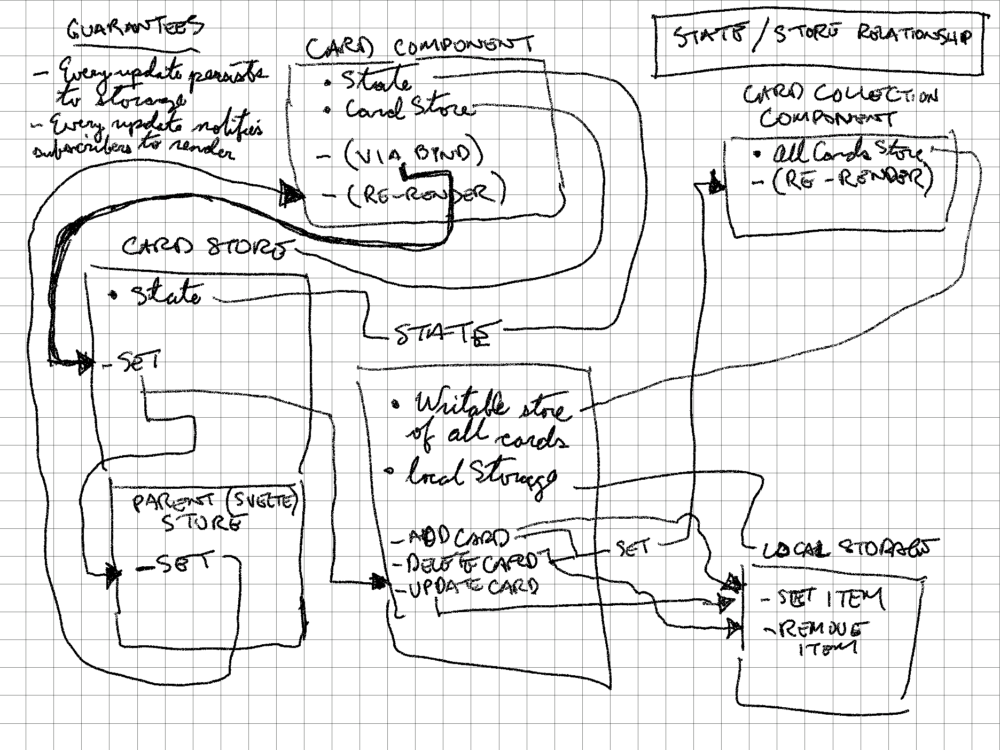

# cardfields

A task observer and capturer.

## State and stores relationship

## Installation

First, install Node. Then:

    npm i
    make run

There are make targets for specific experiments in the Makefile.
